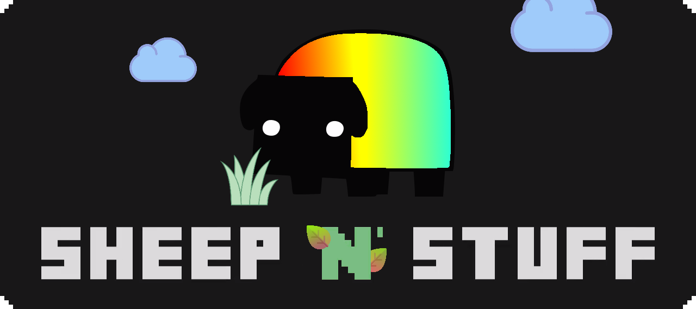

> Exploring and conquering the world through the magic of green thumbs, plants, nature, pigs, cows and sheep 'n' stuff. This mod is focused on providing a more indepth and magical aspect to nature in Minecraft. The name and logo are homages to The Yogscast.

 
